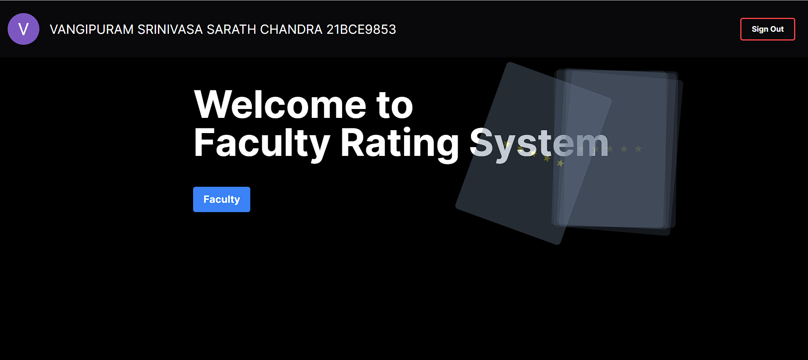

## Description 
A faculty rating website for the University of VIT-AP. Students can rate their faculty and view the ratings of other faculty. This website mainly has three ratings for each faculty: 
1. Attendance rating: How leniant the faculty is with attendance.
2. Teaching rating: How well the faculty teaches.
3. Marks rating: How well the faculty gives marks.

## Demo 


## Technologies used 
<p align="left"> 
    <a href="https://react.dev" target="_blank" rel="noreferrer">  </a> 
    <a href="https://tailwindcss.com/" target="_blank" rel="noreferrer">  </a> 
    <a href="https://www.typescriptlang.org/" target="_blank" rel="noreferrer">  </a>
    <a href="https://nextjs.org/" target="_blank" rel="noreferrer">  </a>
    <a href="https://firebase.google.com" target="_blank" rel="noreferrer">  </a> 
    <a href="https://vercel.com" target="_blank" rel="noreferrer"><svg aria-label="Vercel logotype" height="30" role="img" viewBox="0 0 283 64" width="95"><path d="M141.68 16.25c-11.04 0-19 7.2-19 18s8.96 18 20 18c6.67 0 12.55-2.64 16.19-7.09l-7.65-4.42c-2.02 2.21-5.09 3.5-8.54 3.5-4.79 0-8.86-2.5-10.37-6.5h28.02c.22-1.12.35-2.28.35-3.5 0-10.79-7.96-17.99-19-17.99zm-9.46 14.5c1.25-3.99 4.67-6.5 9.45-6.5 4.79 0 8.21 2.51 9.45 6.5h-18.9zm117.14-14.5c-11.04 0-19 7.2-19 18s8.96 18 20 18c6.67 0 12.55-2.64 16.19-7.09l-7.65-4.42c-2.02 2.21-5.09 3.5-8.54 3.5-4.79 0-8.86-2.5-10.37-6.5h28.02c.22-1.12.35-2.28.35-3.5 0-10.79-7.96-17.99-19-17.99zm-9.45 14.5c1.25-3.99 4.67-6.5 9.45-6.5 4.79 0 8.21 2.51 9.45 6.5h-18.9zm-39.03 3.5c0 6 3.92 10 10 10 4.12 0 7.21-1.87 8.8-4.92l7.68 4.43c-3.18 5.3-9.14 8.49-16.48 8.49-11.05 0-19-7.2-19-18s7.96-18 19-18c7.34 0 13.29 3.19 16.48 8.49l-7.68 4.43c-1.59-3.05-4.68-4.92-8.8-4.92-6.07 0-10 4-10 10zm82.48-29v46h-9v-46h9zM37.59.25l36.95 64H.64l36.95-64zm92.38 5l-27.71 48-27.71-48h10.39l17.32 30 17.32-30h10.39zm58.91 12v9.69c-1-.29-2.06-.49-3.2-.49-5.81 0-10 4-10 10v14.8h-9v-34h9v9.2c0-5.08 5.91-9.2 13.2-9.2z" fill="white"></path></svg></a>
</p>

- React 
- Tailwind
- Typescript
- Next.js
- Firebase
- Vercel

## Getting Started

First, run the development server:

```bash
npm run dev
# or
yarn dev
# or
pnpm dev
```

Open [http://localhost:3000](http://localhost:3000) with your browser to see the result.

You can start editing the page by modifying `app/page.tsx`. The page auto-updates as you edit the file.

This project uses [`next/font`](https://nextjs.org/docs/basic-features/font-optimization) to automatically optimize and load Inter, a custom Google Font.

## Frontend 
The front end is built using React and Next.js. The UI is built using Tailwind CSS. The website is hosted on Vercel. Used server actions and react hooks to manage state 

## Backend 
The backend is built using Firebase. The database is a Firestore database. The authentication is done using Firebase Authentication. The website is hosted on Firebase Hosting. The backend is secured using Firebase Security Rules.